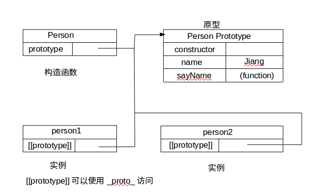

# 原型链


## `__proto__`
当前实例的父类原型。所有引用类型都有`__proto__`属性（除了null）。

```
person1.__proto__ === Person.protptype
```

## prototype
对应对象的原型对象。上面的属性和方法，都会沿着原型链被继承，被称为显示原型。
## constructor
构造函数的原型上的constructor属性执行构造函数本身。

**ps:**
之所以实例化后的对象也有constructor属性，是因为它从原型链上找到对应的属性。即
`instance.constructor === Instance.prototype.constructor === Instance`

## 参考资料
1. https://developer.mozilla.org/en-US/docs/Web/JavaScript/Reference/Global_Objects/Object/prototype
2. https://xxxgitone.github.io/2017/06/08/%E4%B8%80%E7%AF%87%E6%96%87%E7%AB%A0%E7%9C%8B%E6%87%82-proto-%E5%92%8Cprototype%E7%9A%84%E5%85%B3%E7%B3%BB%E5%8F%8A%E5%8C%BA%E5%88%AB/

