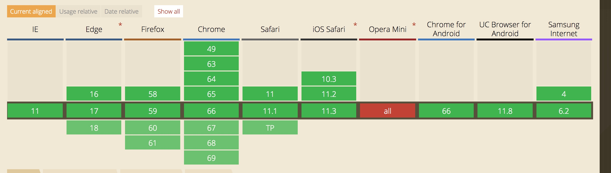

# 异步处理
javascript是单线程的，那么如果执行到某个地方，需要耗费大量时间，那么就会形成阻塞。这就是为何要做异步的原因。
异步处理的机制，就是将对应的任务移出主线程，push到等待队列。当主线程执行完毕，才会执行队列里的任务。

## setTimeout、setInterval
这两个是最传统的两个异步处理方法，分别是延迟指定时间，再触发对应的任务；每隔指定时间段，触发一次任务。

```
clearTimeout(timer);
var timer = setTimeout(func,time);
```
1. 注意清除对应的timer，否则会让任务触发变的紊乱
2. 注意执行对应的方式，是指定任务在某个时间点加入异步队列。如果当时有其他任务在执行，会继续等待，按照顺序执行。

## requestAnimateFrame
window下的属性，固定时间间隔触发对应的回调。
兼容性如下：



一般屏幕的刷新频率是60HZ，即每秒60次，16.7ms执行一次。这样保证每一帧，都会触发一次，不会出现掉帧的情况。

## Promise
ES5出的异步模型
## await
ES6出的异步标识符

